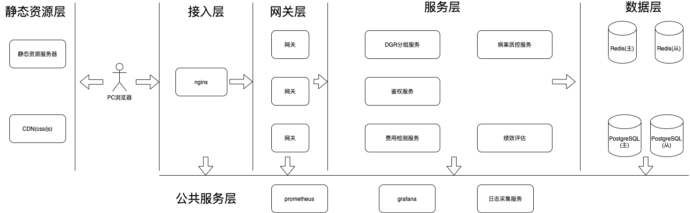

# paper

## 系统设计

### 需求分析

#### 功能性需求

#### 非功能性需求

##### 可靠性

* 每个服务多个节点,避免一个单点故障
  
* 数据库一主一从,避免单点故障

##### 扩展性

* 通过网关接入请求,实现动态路由,方便后端服务的伸缩
  
* 每个服务无状态,方便扩容和缩容
  
* 前后端分离,方便功能迭代和部署

##### 性能

* 采用redis作为缓存加速读的速度
  
* 数据库采用主从读写分离技术,提高读写性能
  
* 服务之间通过RPC调用

##### 可维护性

* 服务和数据接入prometheus监控系统,并通过grafana展示,实现故障告警

##### 易用性/兼容性/安全性

* 编

### 系统概要设计

#### 系统架构设计

上图是整体系统架构设计图

##### 静态接入层

提供前端的html页面/css文件/js文件等静态文件的服务.其中,通过CDN加速.

前后端分离.

Vue技术介绍TODO

虚拟节点

##### 接入层

利用nginx反向代理,高高性能等特性,作为服务的接入层.

##### 网关层

采用了Spring cloud gateway组件,利用其stream的特性实现高性能.在这一层实现服务的路由/鉴权等功能.屏蔽的后端服务的细节.

Spring cloud gateway介绍 TODO.

事务/IOC技术/AOP

##### 服务层

主要包含DGR分组服务/鉴权服务/费用检测服务/病案质控服务/绩效评估服务等业务逻辑.服务之间通过RPC通信.每个服务都有3个节点,确保服务的性能和可靠性.采用了Spring boot&Spring cloud技术栈.

Spring boot技术介绍.TODO

##### 数据层

包含了缓存数据库Redis和关系型数据库PostgreSQL.都采用了主从模式.

Redis介绍TODO

PostgreSQL介绍TODO

#### 模块说明

模块1

模块2

...

### 安全设计

TODO

## 系统实现

### 系统开发环境与整体架构

### 代码设计

分层

TODO

微服务

TODO

restFul接口

TODO

### 代码规范

命名,摘抄google+阿里的风格TODO

### 数据设计

表结构设计细节TODO

### 模块设计

TODO

## 系统测试

### 测试环境

硬件

服务部署情况

客户端测试环境

### 功能性测试

功能1测试case TODO

功能2测试case TODO

...

### 非功能性测试

安全性

TODO

可靠性

TODO

性能

TODO

扩展性

TODO